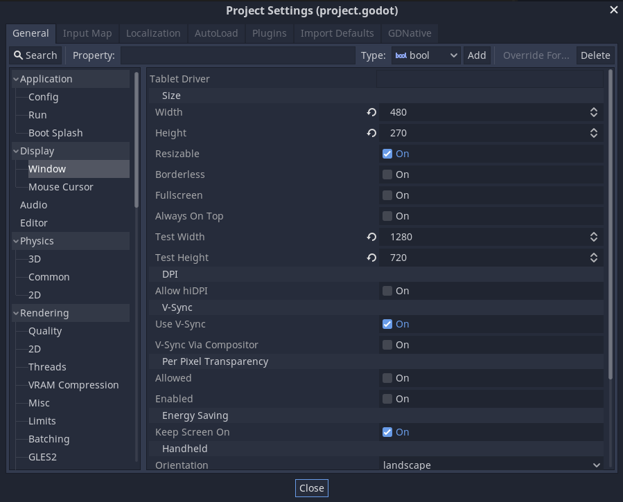
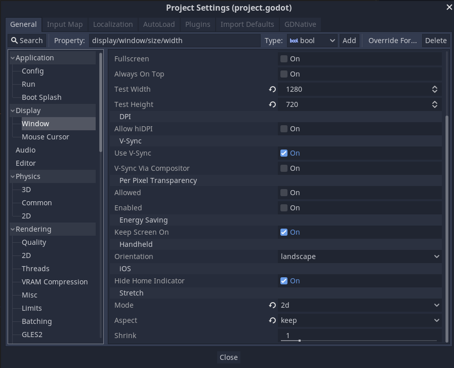
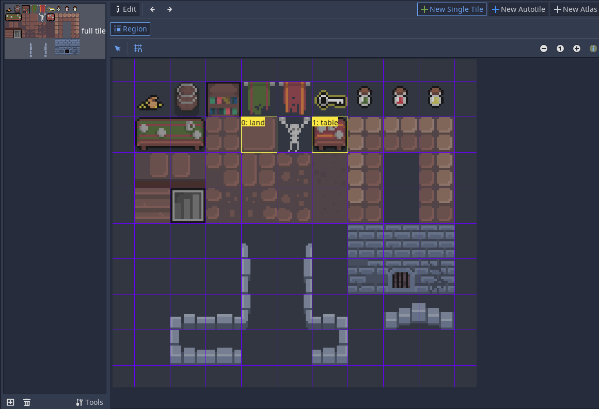

# Roguelike

Roguelike — жанр компьютерных игр. Характерными особенностями классического roguelike являются генерируемые случайным образом уровни, пошаговость и необратимость смерти персонажа — в случае его гибели игрок не может загрузить игру и должен начать её заново.

## Настройки экрана

Projects->Project Settings->Window

Для начала скачаем пак с картинками и анимациями: [ссылка](https://o-lobster.itch.io/)

## TileMap

- New TileSet
- Загрузить картинку из папки
- New Single Title

